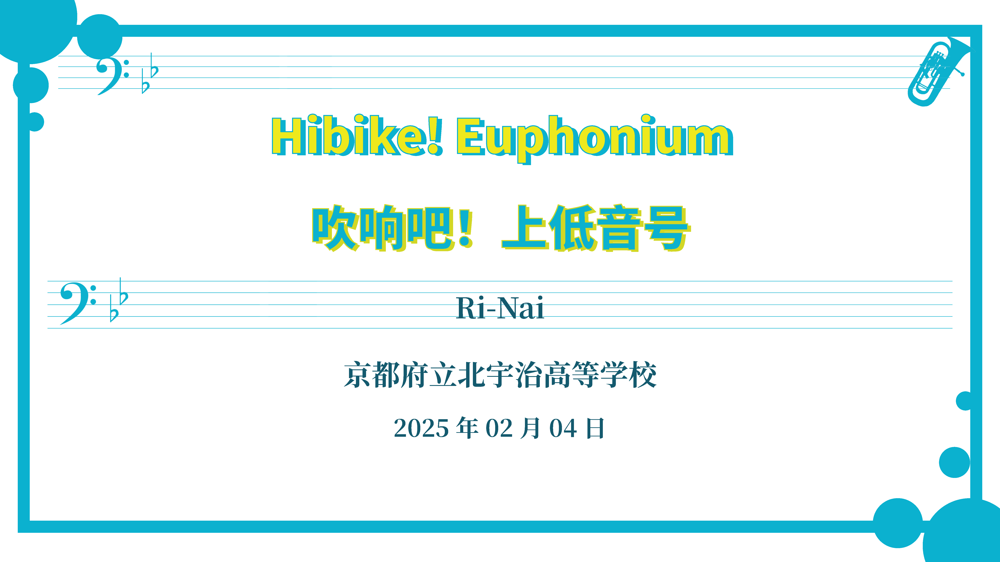
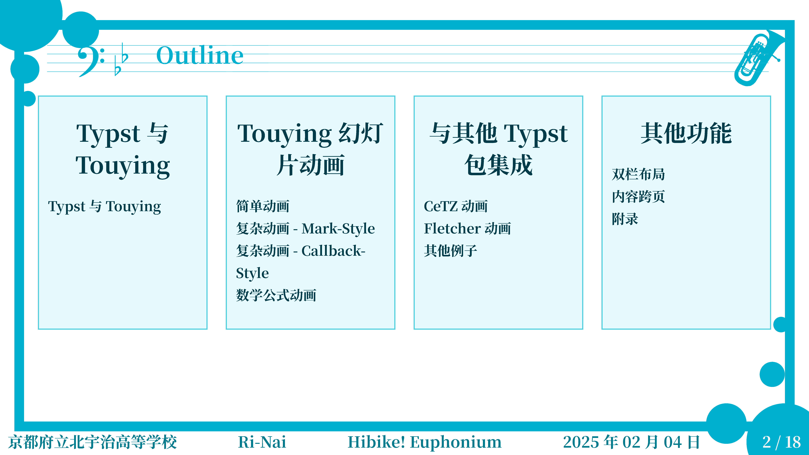
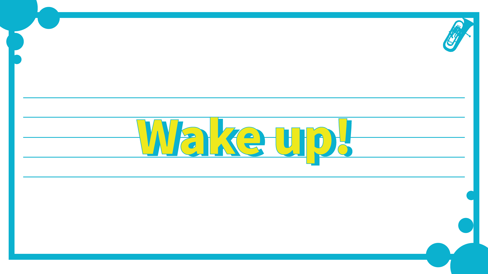
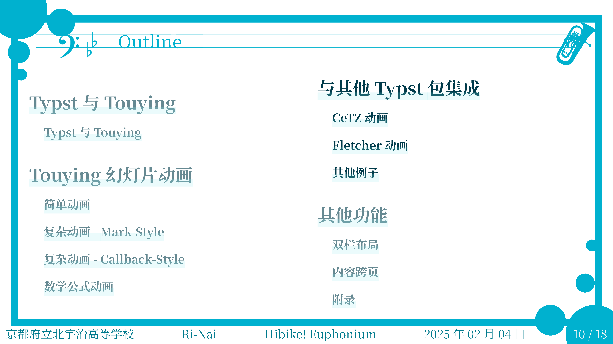
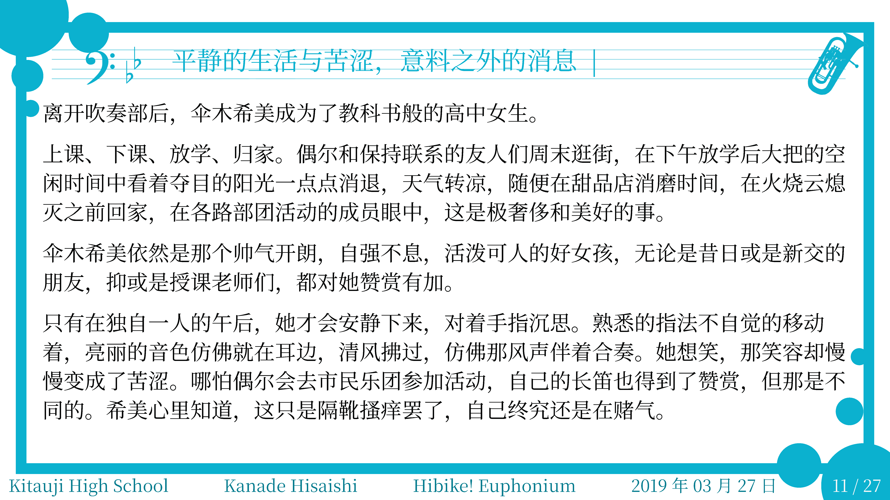

# 🎺 吹响吧！上低音号 - Touying 主题模板

基于 Typst 和 Touying 框架开发的演示文稿主题模板，灵感源自《吹响吧！上低音号》动画作品。通过现代排版系统实现优雅的演示文稿设计，适配学术汇报与创意展示场景。

## ✨ 灵感来源：  
[Touying](https://touying-typ.github.io/) 的 [aqua](https://touying-typ.github.io/zh/docs/themes/aqua/) 与 [stargazer](https://touying-typ.github.io/zh/docs/themes/stargazer/) 主题

## 📸 主题截图

| 功能演示 | 页面效果 |
|---------|----------|
|  |  |
|  |  |
|  |  |

## 🚀 快速使用

### 基础配置
在项目根目录中新建 `.typ` 文件：

```typst
// 导入主题模板
#import "touying-euphonium.typ": *

// 应用主题配置
#show: euphonium-theme.with(
  aspect-ratio: "16-9",
  config-info(
    title: [标题文本/内容块],      // 主标题
    subtitle: [副标题内容],       // 副标题
    institution: [机构名称],      // 组织单位
    author: [默认作者],          // 单作者模式
    authors: ([作者1], [作者2]),  // 多作者模式
    date: datetime(...),        // 日期格式
  )
)
```
